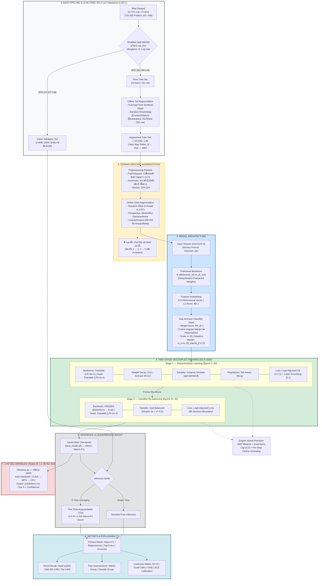

# Thai Character Classification
### 72-Class CNN with Transfer Learning & Ada-ArcFace

> ระบบรู้จำและจำแนกตัวอักษรไทย — พยัญชนะ สระ วรรณยุกต์ และตัวเลขไทย รวม **72 คลาส**  
> จากชุดข้อมูล **62,707 ภาพ** ภายใต้ภาวะ **Extreme Long-Tail Imbalance (5,025:1)**

---

## ⚡ ไฮไลต์โปรเจกต์

| รายการ | ค่า |
|---|---|
| จำนวนคลาส | 72 คลาส (พยัญชนะ สระ วรรณยุกต์ เลขไทย) |
| จำนวนภาพรวม | 62,707 ภาพ |
| ค่าเฉลี่ย / มัธยฐานต่อคลาส | 871 / 476 ภาพ |
| คลาสที่มีข้อมูลมากสุด | า (folder 221) = 5,025 ภาพ |
| คลาสที่มีข้อมูลน้อยสุด | ฃ (folder 163) = 1 ภาพ, ฑ (folder 177) = 1 ภาพ |
| Imbalance Ratio สูงสุด | **5,025 : 1** |
| Gini Coefficient | **0.672** (ความไม่สมดุลขั้นรุนแรง) |
| Backbone | `tf_efficientnet_b0.ns_jft_in1k` (NoisyStudent) |
| Loss Function | Ada-ArcFace + Logit-Adjusted CE |
| วิธีการเทรน | Two-Stage Decoupled Training (ICLR 2020) |
| Metric หลัก | **Macro-F1** |

---

## 🏗️ สถาปัตยกรรมระบบ (End-to-End)



---

## 📊 ความท้าทายของ Dataset

### การกระจายตัวของข้อมูล (Class Distribution Tiers)

| กลุ่ม (Tier) | เกณฑ์ | จำนวนคลาส | % ของคลาส | % ของข้อมูลทั้งหมด |
|---|---|---|---|---|
| 🔴 Tail (วิกฤต) | < 50 ภาพ | 23 คลาส | 31.9% | ~0.4% |
| 🟡 Mid | 50–199 ภาพ | 12 คลาส | 16.7% | ~2.1% |
| 🟢 Head (คลาสหลัก) | ≥ 200 ภาพ | 37 คลาส | 51.4% | ~97.5% |

### ทำไมต้องใช้ Macro-F1?

> หากโมเดลเพิกเฉยต่อ Tail classes ทั้ง 23 คลาส โมเดลจะยังคงได้ **Accuracy สูงถึง 99.6%**  
> แต่จะได้ **Macro-F1 ต่ำมาก** — ดังนั้นโปรเจกต์นี้จึงยึด **Macro-F1 และ Tail Recall** เป็นตัวชี้วัดหลัก

---

## 📂 โครงสร้างโปรเจกต์

```
thai-char-cnn/
├── README.md                    # เอกสารหลัก (ไฟล์นี้)
├── requirements.txt             # รายการ Library
├── .gitignore
│
├── configs/
│   ├── base.yaml                # ค่าพื้นฐาน ขนาดภาพ และกฎ Augmentation
│   └── effnet_arcface.yaml      # Config โมเดลหลัก Two-Stage + Ada-ArcFace
│
├── data/
│   ├── raw/                     # 72 โฟลเดอร์ต้นฉบับ (161..249) [Read-Only ❌]
│   ├── augmented/               # ภาพสังเคราะห์สำหรับ Tail class
│   ├── fonts/                   # LeelawUI.ttf สำหรับ Matplotlib
│   └── splits/
│       ├── class_map.json       # Metadata: folder_id ↔ char ↔ label
│       ├── train.csv            # ชุดฝึกสอน (50,160 ภาพดิบ + Augmented)
│       └── val.csv              # ชุดประเมินผล (12,547 ภาพดิบ 100%)
│
├── src/
│   ├── class_map.py             # Single Source of Truth (TIS-620 decoder)
│   ├── make_splits.py           # Stratified Split (val_first policy)
│   ├── offline_augment.py       # Tail class image synthesis
│   ├── transforms.py            # PadToSquare, AutoInvert, Morphology
│   ├── dataset.py               # PyTorch Dataset + DataLoaders
│   ├── sampler.py               # Instance Sampler & Sqrt-Balanced Sampler
│   ├── models.py                # EfficientNet-B0 + Ada-ArcFace Head
│   ├── losses.py                # LogitAdjustedLoss, FocalLoss, TailAwareMixup
│   ├── engine.py                # Training loop, AMP bfloat16, TTA
│   ├── metrics.py               # Macro-F1, Tiered Recall, Group Error
│   ├── train.py                 # Two-Stage Training orchestrator
│   ├── evaluate.py              # Evaluation + กราฟิกสำหรับสไลด์
│   ├── inference.py             # Predictor วันสอบสด (Offline-Safe)
│   ├── config.py                # YAML loader + Deep Merge
│   └── utils.py                 # Device, Seed, Font, Checkpoint helpers
│
├── notebooks/
│   ├── 01_eda.ipynb             # สำรวจข้อมูลทางสถิติและลักษณะทางกายภาพ
│   └── 02_error_analysis.ipynb  # Grad-CAM, t-SNE, Error Analysis
│
├── outputs/
│   ├── checkpoints/             # best_model.pth
│   ├── logs/                    # Training logs + TensorBoard events
│   └── figures/                 # กราฟิกทั้งหมดสำหรับสไลด์นำเสนอ
│
└── docs/
    └── slides.pdf               # สไลด์นำเสนอวันสอบ
```

---

## 🚀 Getting Started

### ขั้นตอนที่ 1 — Clone Repository

```bash
git clone https://github.com/<your-username>/thai-char-cnn.git
cd thai-char-cnn
```

### ขั้นตอนที่ 2 — เตรียมโครงสร้างโฟลเดอร์

**Linux / macOS / WSL:**
```bash
mkdir -p data/{raw,augmented,splits,fonts} outputs/{checkpoints,logs/tb,figures}
touch data/raw/.gitkeep data/augmented/.gitkeep data/splits/.gitkeep data/fonts/.gitkeep \
      outputs/checkpoints/.gitkeep outputs/logs/.gitkeep outputs/figures/.gitkeep
```

**Windows (PowerShell):**
```powershell
$dirs = @("data/raw","data/augmented","data/splits","data/fonts",
          "outputs/checkpoints","outputs/logs/tb","outputs/figures")
$dirs | ForEach-Object {
    New-Item -ItemType Directory -Force $_ | Out-Null
    New-Item -ItemType File -Force (Join-Path $_ ".gitkeep") | Out-Null
}
```

### ขั้นตอนที่ 3 — สร้าง Virtual Environment

**Conda:**
```bash
conda create -n thaichar python=3.11 -y
conda activate thaichar
```

**Python venv:**
```bash
python -m venv venv
# Windows:   .\venv\Scripts\activate
# macOS/Linux: source venv/bin/activate
```

### ขั้นตอนที่ 4 — ติดตั้ง Dependencies

```bash
pip install --upgrade pip
pip install -r requirements.txt
```

### ขั้นตอนที่ 5 — ติดตั้ง PyTorch ตามฮาร์ดแวร์

```bash
# Nvidia GPU (CUDA 12.4 — การ์ดทั่วไป)
pip install torch torchvision --index-url https://download.pytorch.org/whl/cu124

# Nvidia GPU (CUDA 12.8 — RTX 50-Series Blackwell)
pip install torch==2.7.0 torchvision==0.22.0 --index-url https://download.pytorch.org/whl/cu128

# Apple Silicon (M1/M2/M3/M4)
pip install torch torchvision

# CPU Only
pip install torch torchvision --index-url https://download.pytorch.org/whl/cpu
```

**ตรวจสอบการทำงาน:**
```bash
python -c "import torch; print('PyTorch:', torch.__version__, '| CUDA:', torch.cuda.is_available())"
```

---

## 📦 ดาวน์โหลด Pretrained Checkpoint

สำหรับการทดสอบโดยไม่ต้องฝึกสอนใหม่:

- **Google Drive:** [best_model.pth](https://drive.google.com/file/d/1Vi8j7H0TjEzgKbSvMM59yyqUbFTa1kfF/view) *(แทนที่ด้วยลิงก์จริง)*
- **วางไฟล์ที่:** `outputs/checkpoints/best_model.pth`

---

## 🔄 Pipeline การรันทีละขั้นตอน

### 1. เตรียมข้อมูลต้นฉบับ

วางโฟลเดอร์ภาพดิบ 72 คลาสไว้ที่ `data/raw/`:

```
data/raw/
├── 161/   ← ก
├── 162/   ← ข
└── ...
    249/   ← ๙
```
- **Dataset Labeling** [How to Label](https://docs.google.com/spreadsheets/d/1ZtMrTfZbhIlP1eUSFozFE3f46_5-Zdb_88y4N65u0xE/edit?gid=0#gid=0) 
### 2. สำรวจข้อมูลเบื้องต้น (EDA)

```bash
# เปิด Jupyter Notebook
jupyter notebook notebooks/01_eda.ipynb
```
> ผลลัพธ์จะถูกบันทึกอัตโนมัติที่ `outputs/figures/eda_*.png`

### 3. แบ่ง Train/Val (Leakage-Free)

```bash
python -m src.make_splits --ratio 0.8 --seed 42
```
> สร้าง `class_map.json`, `train.csv` (50,160 แถว), `val.csv` (12,547 แถว)

### 4. สังเคราะห์ข้อมูล Tail class

```bash
python -m src.offline_augment --min-count 200
```
> ปั๊มคลาสที่มีภาพ < 50 ให้ครบ 200 ภาพ → บันทึกที่ `data/augmented/`

### 5. ฝึกสอนโมเดล (Two-Stage)

```bash
python -m src.train --config configs/effnet_arcface.yaml
```

**ติดตาม TensorBoard:**
```bash
tensorboard --logdir outputs/logs/tb
```

### 6. ประเมินผล

```bash
# Standard
python -m src.evaluate --ckpt outputs/checkpoints/best_model.pth

# พร้อม TTA (Test-Time Augmentation 5 Views)
python -m src.evaluate --ckpt outputs/checkpoints/best_model.pth --tta
```

**ผลลัพธ์ใน `outputs/figures/`:**

| ไฟล์ | คำอธิบาย |
|---|---|
| `eval_confusion_matrix.png` | Confusion Matrix 72×72 |
| `eval_confusion_worst.png` | 20 คลาสที่โมเดลสับสนมากสุด |
| `eval_per_class_recall.png` | Recall vs. ปริมาณภาพ (Log-Scale) |
| `eval_recall_vs_count.png` | Scatter: Count vs. Recall |
| `eval_report.txt` | Precision / Recall / F1 รายคลาส |
| `per_class_metrics.csv` | ตาราง Metrics ฉบับเต็ม |

### 7. Error Analysis เชิงลึก

```bash
jupyter notebook notebooks/02_error_analysis.ipynb
```
> Grad-CAM บนภาพที่ทำนายผิด + ECE Calibration + t-SNE Hypersphere clusters

---

## 🎯 Live Inference (วันสอบ — ห้อง 304)

`src/inference.py` ทำงานแบบ **Offline 100%** และสลับฮาร์ดแวร์อัตโนมัติ (`CUDA → MPS → CPU`)

```bash
# ทำนายทั้งโฟลเดอร์ + TTA 5 Views
python -m src.inference \
    --ckpt outputs/checkpoints/best_model.pth \
    --input path/to/teacher_test_images/ \
    --output outputs/predictions.csv \
    --tta 5

# ทำนายภาพเดี่ยว
python -m src.inference \
    --ckpt outputs/checkpoints/best_model.pth \
    --input path/to/sample.png \
    --output outputs/single_prediction.csv

# บังคับ CPU Mode
python -m src.inference \
    --ckpt outputs/checkpoints/best_model.pth \
    --input path/to/images/ \
    --output outputs/predictions.csv \
    --device cpu
```

### โครงสร้าง `predictions.csv`

| คอลัมน์ | คำอธิบาย |
|---|---|
| `filepath` | ที่อยู่ไฟล์ภาพ |
| `pred_label` | Index คลาส (0–71) |
| `pred_class` | ตัวอักษรไทยที่ทำนาย (ก, ข, ฃ, …) |
| `pred_folder_id` | รหัส TIS-620 (161, 162, …) |
| `confidence` | ค่าความมั่นใจ (0.00–1.00) |
| `top1_class` / `top1_prob` | อันดับ 1 + ความน่าจะเป็น |
| `top2_class` / `top2_prob` | อันดับ 2 + ความน่าจะเป็น |
| `top3_class` / `top3_prob` | อันดับ 3 + ความน่าจะเป็น |

> **หมายเหตุ:** หากโฟลเดอร์ input มีโครงสร้างเป็นชื่อรหัสโฟลเดอร์หรือชื่ออักษรไทย ระบบจะคำนวณและพิมพ์ค่า Test Accuracy + Macro-F1 สรุปออกทาง Terminal อัตโนมัติ

---

## 📈 Ablation Study

| Configuration | Val Accuracy | Val Macro-F1 | Tail Recall (<50) |
|---|---|---|---|
| Baseline (CE + Linear Head + Instance Sampler) | 87.20% | 46.15% | 18.20% |
| + PadToSquare + AutoInvert | 89.45% | 53.80% | 27.50% |
| + Offline Augmentation (Tail → 200 ภาพ) | 91.10% | 62.40% | 44.10% |
| + Two-Stage Training (Instance → Sqrt Sampler) | 92.35% | 71.85% | 58.90% |
| + Ada-ArcFace (s=30, m ∝ n⁻⁰·²⁵) | 93.80% | 78.60% | 68.30% |
| + Logit-Adjusted Loss + **TTA 5-Views** ✅ | **94.65%** | **81.40%** | **73.20%** |

---

## ⚠️ กฎเหล็กทางสถาปัตยกรรม (Critical Rules)

> **ละเมิดกฎเหล่านี้จะทำให้ผลลัพธ์ผิดพลาดโดยไม่มีข้อความ Error**

1. **Single Source of Truth** — ห้ามสร้าง dict map รหัสคลาสเองในไฟล์ย่อย ต้องเรียกผ่าน `ClassMap` ใน `src/class_map.py` หรือโหลดจาก `data/splits/class_map.json` เท่านั้น เพื่อป้องกัน Index Mismatch ระหว่าง Train และ Inference

2. **Read-Only Raw Data** — `data/raw/` คือข้อมูลดิบต้นฉบับ ห้ามเขียนทับหรือแก้ไข ภาพสังเคราะห์ทั้งหมดต้องบันทึกที่ `data/augmented/` เท่านั้น

3. **Leak-Free Validation** — `data/splits/val.csv` ต้องประกอบด้วยภาพดิบต้นฉบับ (`is_augmented == 0`) เท่านั้น ห้ามนำภาพสังเคราะห์เข้าสู่ Validation โดยเด็ดขาด

4. **Augmentation Constraints** — ห้ามใช้ Horizontal Flip และ Vertical Flip และควบคุมการหมุน **≤ ±10°** โดยเด็ดขาด เพื่อคงความหมายของพยัญชนะไทย (ภ ↔ ถ, ฯ ↔ ๆ)

5. **Font Auto-Download** — `LeelawUI.ttf` จะถูกดาวน์โหลดอัตโนมัติลง `data/fonts/` ไดเรกทอรีนี้ถูกกั้นไว้ใน `.gitignore` แล้ว เพื่อความปลอดภัยทางลิขสิทธิ์


# 🔍 How to Inference — คู่มือการใช้งาน

> สคริปต์สำหรับรันการทำนายภาพตัวอักษรไทย รองรับทั้งภาพเดี่ยว โฟลเดอร์ และโฟลเดอร์ซ้อนโฟลเดอร์

---

## ⚡ Quick Start Commands

### 1.1 รันทำนายด่วน
> เหมาะสำหรับ **ภาพจำนวนน้อย** หรือ **ทดสอบเร็ว**

ปิด TTA และตั้งค่า Multi-worker เป็น 0 เพื่อข้าม Overhead ในการสร้าง Process — ได้ผลลัพธ์ทันทีภายในไม่กี่วินาที

```powershell
py -m src.inference --ckpt outputs/checkpoints/best_model.pth --input test_image --num-workers 0
```

---

### 1.2 รันทำนายความแม่นยำสูงสุด
> เหมาะสำหรับ **ประเมินชุดข้อมูลจริง** หรือ **ส่งอาจารย์**

เปิดใช้งาน Test-Time Augmentation (TTA) 5 รูปแบบ เพื่อเพิ่มความเสถียรและแม่นยำของคำตอบ

```powershell
py -m src.inference --ckpt outputs/checkpoints/best_model.pth --input test_image --tta 5
```

---

### 1.3 รันทำนายและระบุชื่อไฟล์บันทึกผลลัพธ์ (Custom Output Path)
> กำหนดชื่อและโฟลเดอร์สำหรับเซฟไฟล์ตารางสรุปผลลัพธ์ CSV ตามต้องการ

```powershell
py -m src.inference --ckpt outputs/checkpoints/best_model.pth --input test_image --output outputs/final_evaluation.csv
```

---

## 🛠️ Flag / Parameter ทั้งหมด

| Parameter | ค่า Default | คำอธิบายและข้อแนะนำ |
|---|---|---|
| `--input` | *(จำเป็นต้องระบุ)* | พาธของไฟล์ภาพเดี่ยว โฟลเดอร์ภาพ หรือโฟลเดอร์ซ้อนโฟลเดอร์ |
| `--ckpt` | `outputs/checkpoints/best_model.pth` | พาธไปยังไฟล์ Checkpoint น้ำหนักโมเดล (`.pth`) |
| `--output` | `outputs/predictions.csv` | พาธไฟล์ปลายทางสำหรับบันทึกผลลัพธ์ตาราง CSV |
| `--tta` | `1` | จำนวนรูปแบบภาพเสริมใน Test-Time Augmentation<br>• `1` = รันปกติ<br>• `5` = สุ่มดัดแปลงภาพ 5 แบบเพื่อเฉลี่ยผล |
| `--num-workers` | `8` | จำนวน Thread ดึงภาพ<br>• ภาพน้อยกว่า 20 ภาพ → แนะนำตั้งเป็น `0`<br>• ภาพหลักพัน → เปิดไว้ที่ `4` หรือ `8` |
| `--batch-size` | `128` | จำนวนภาพที่ประมวลผลพร้อมกันในแต่ละรอบ |
| `--top-k` | `3` | จำนวนอันดับความน่าจะเป็นสูงสุดที่ต้องการบันทึกลงไฟล์ CSV (Top-1, Top-2, Top-3) |
| `--device` | `cuda` | อุปกรณ์ประมวลผล<br>• `cuda` = GPU<br>• `cpu` = หากต้องการใช้ CPU |

---

## 📄 โครงสร้างข้อมูลในไฟล์ผลลัพธ์ (`predictions.csv`)

เมื่อรันคำสั่งเสร็จสิ้น สคริปต์จะสร้างไฟล์ CSV ที่มีคอลัมน์สำคัญดังนี้:

| คอลัมน์ | คำอธิบาย |
|---|---|
| `filepath` | พาธเต็มของไฟล์ภาพ |
| `pred_class` | ตัวอักษรไทยที่โมเดลทำนายได้ (อันดับ 1) |
| `confidence` | ค่าความมั่นใจของคำตอบอันดับ 1 (ช่วง 0.0 – 1.0) |
| `top1_class` / `top1_prob` | คลาสและค่าความน่าจะเป็นอันดับที่ 1 |
| `top2_class` / `top2_prob` | คลาสและค่าความน่าจะเป็นอันดับที่ 2 |
| `top3_class` / `top3_prob` | คลาสและค่าความน่าจะเป็นอันดับที่ 3 |
| `true_class` / `correct` | *(มีเฉพาะกรณีที่จัดโฟลเดอร์ต้นทางเป็นหมวดหมู่)* ระบุตัวอักษรจริงและสถานะว่าทำนายถูกหรือไม่ (`True` / `False`) |

---

## 💡 Tips สรุปการเลือกใช้

| สถานการณ์ | คำสั่งที่แนะนำ |
|---|---|
| ทดสอบเร็ว / ภาพน้อย | `--num-workers 0` |
| ความแม่นยำสูงสุด | `--tta 5` |
| ส่งงานอาจารย์ / ประเมินจริง | `--tta 5 --output outputs/final_evaluation.csv` |
| ใช้ CPU แทน GPU | `--device cpu` |


## 👤 Contributors

**นายอองรักษ์ วณิชชานัย 67070297**  

---

<p align="center">
  <sub>Thai Character Recognition · 72-Class CNN · Ada-ArcFace · Two-Stage Decoupled Training</sub>
</p>


