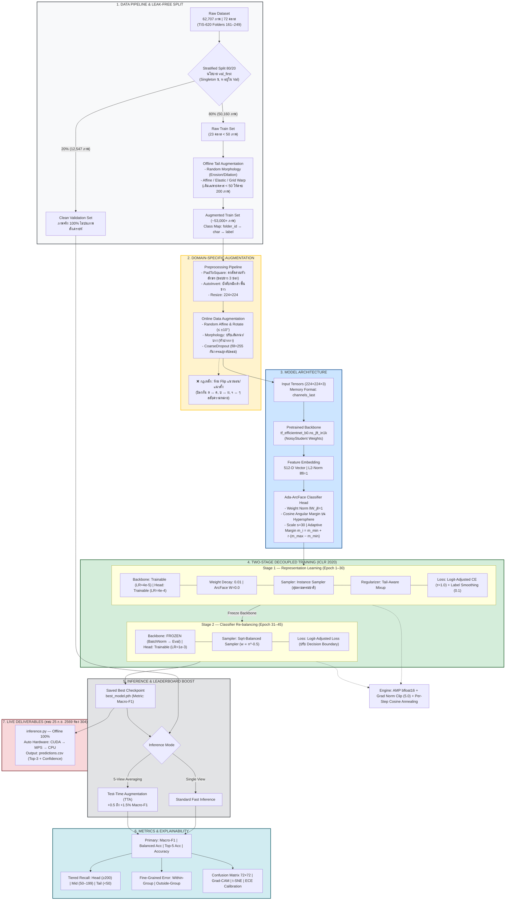

# Thai Character Classification

### 72-Class CNN with Transfer Learning

> ระบบรู้จำและจำแนกตัวอักษรไทย — พยัญชนะ สระ วรรณยุกต์ และตัวเลขไทย รวม **72 คลาส**
> จากชุดข้อมูล **62,707 ภาพ** ภายใต้ภาวะ **Extreme Long-Tail Imbalance (5,025 : 1)**

---

## สารบัญ

1. [ไฮไลต์โปรเจกต์](#-ไฮไลต์โปรเจกต์)
2. [สถาปัตยกรรมระบบ](#-สถาปัตยกรรมระบบ-end-to-end)
3. [ความท้าทายของ Dataset](#-ความท้าทายของ-dataset)
4. [โครงสร้างโปรเจกต์](#-โครงสร้างโปรเจกต์)
5. [Getting Started](#-getting-started)
6. [Pipeline การเทรนชุดหลัก](#-pipeline-การเทรนชุดหลัก)
7. [Fine-tuning Workflow](#-fine-tuning-workflow)
8. [Live Inference](#-live-inference-วันสอบ--ห้อง-304)
9. [Ablation Study](#-ablation-study)
10. [กฎเหล็กทางสถาปัตยกรรม](#️-กฎเหล็กทางสถาปัตยกรรม-critical-rules)
11. [Contributors](#-contributors)

---

## ⚡ ไฮไลต์โปรเจกต์

| รายการ | ค่า |
|---|---|
| จำนวนคลาส | 72 คลาส (พยัญชนะ สระ วรรณยุกต์ เลขไทย) |
| จำนวนภาพรวม | 62,707 ภาพ |
| ค่าเฉลี่ย / มัธยฐานต่อคลาส | 871 / 476 ภาพ |
| คลาสที่มีข้อมูลมากสุด | า (folder 210) = 5,025 ภาพ |
| คลาสที่มีข้อมูลน้อยสุด | ฃ (folder 163) = 1 ภาพ, ฑ (folder 177) = 1 ภาพ |
| Imbalance Ratio สูงสุด | **5,025 : 1** |
| Gini Coefficient | **0.672** (ความไม่สมดุลขั้นรุนแรง) |
| Backbone | `tf_efficientnet_b0.ns_jft_in1k` (NoisyStudent) |
| Loss Function | Ada-ArcFace + Logit-Adjusted CE |
| วิธีการเทรน | Two-Stage Decoupled Training (Kang et al., ICLR 2020) |
| Metric หลัก | **Macro-F1** |

---

## 🏗 สถาปัตยกรรมระบบ (End-to-End)



---

## 📊 ความท้าทายของ Dataset

### การกระจายตัวของข้อมูล (Class Distribution Tiers)

| กลุ่ม (Tier) | เกณฑ์ | จำนวนคลาส | % ของคลาส | % ของข้อมูลทั้งหมด |
|---|---|---|---|---|
| 🔴 Tail (วิกฤต) | < 50 ภาพ | 23 คลาส | 31.9% | ~0.4% |
| 🟡 Mid | 50–199 ภาพ | 12 คลาส | 16.7% | ~2.1% |
| 🟢 Head (คลาสหลัก) | ≥ 200 ภาพ | 37 คลาส | 51.4% | ~97.5% |

### ทำไมต้องใช้ Macro-F1?

หากโมเดลเพิกเฉยต่อ Tail classes ทั้ง 23 คลาส โมเดลจะยังคงได้ Accuracy สูงถึง **99.6%** แต่จะได้ Macro-F1 ต่ำมาก
โปรเจกต์นี้จึงยึด **Macro-F1** และ **Tail Recall** เป็นตัวชี้วัดหลัก เพื่อความยุติธรรมต่อทุกคลาส

---

## 📂 โครงสร้างโปรเจกต์

```text
thai-char-cnn/
├── README.md                    # คู่มือการรัน Train, Finetune, Evaluate และ Inference
├── requirements.txt             # รายการ Library ที่ต้องติดตั้ง
├── configs/
│   ├── base.yaml                # ค่ามาตรฐานกลาง (ฮาร์ดแวร์, นโยบายความปลอดภัย, กฎเหล็ก)
│   ├── effnet_arcface.yaml      # คอนฟิกหลักสำหรับส่งอาจารย์ (Two-Stage + ArcFace + Logit Adjustment)
│   └── finetune.yaml            # คอนฟิกเฉพาะ Fine-tuning (แยก paths, ปรับ LR และ Epochs)
├── data/
│   ├── fonts/                   # ฟอนต์ LeelawUI.ttf สำหรับแสดงภาษาไทยในกราฟ
│   ├── raw/                     # ข้อมูลต้นฉบับ 62,707 ภาพของอาจารย์ (ห้ามแก้ไขเด็ดขาด)
│   ├── augmented/               # ภาพจาก Offline Augmentation สำหรับการเทรนหลัก
│   ├── splits/                  # train.csv, val.csv และ class_map.json ชุดหลัก
│   ├── finetune_raw/            # ชุดข้อมูลใหม่สำหรับ Fine-tuning
│   ├── finetune_augmented/      # ภาพสังเคราะห์สำหรับชุด Fine-tune
│   └── finetune_splits/         # train.csv และ val.csv สำหรับชุด Fine-tune
├── src/
│   ├── __init__.py              # ประกาศ Package และรายการ Exports
│   ├── analyze_dataset.py       # สกัดสถิติข้อมูลดิบ (EDA) และสร้างกราฟชุดข้อมูล
│   ├── class_map.py             # Single Source of Truth (TIS-620 ↔ 72 คลาส ↔ Label ID)
│   ├── config.py                # โหลด YAML, สืบทอดคอนฟิก และ Assertion Guards
│   ├── dataset.py               # DataLoader (Alpha Blending, Safe Unicode Image Reader)
│   ├── engine.py                # Train/Val loop, bfloat16 AMP, Per-step Cosine LR Scheduler
│   ├── evaluate.py              # ประเมินผลละเอียด (Confusion Matrix, Recall, Grad-CAM)
│   ├── inference.py             # สคริปต์ทดสอบสดในห้องสอบ (Offline Mode + TTA 5-view)
│   ├── losses.py                # Logit Adjusted Loss, Focal Loss, Tail-Aware Mixup
│   ├── make_splits.py           # แบ่ง Train 80% / Val 20% (ป้องกัน Data Leakage)
│   ├── metrics.py               # Macro-F1, Tiered Recall (Head/Mid/Tail), Group Error Analysis
│   ├── models.py                # EfficientNet-B0 + ArcFace Head (Adaptive Angular Margin)
│   ├── offline_augment.py       # สังเคราะห์ภาพยก Tail Classes ใน Training Set
│   ├── sampler.py               # Sqrt WeightedRandomSampler ปรับสมดุลข้อมูลใน Stage 2
│   ├── train.py                 # Orchestrator คุม Two-Stage Decoupled Training
│   ├── transforms.py            # Online Transforms, Pad-to-Square, Morphology, กฎห้าม Flip
│   └── utils.py                 # Seed isolation, จัดการ Checkpoint, ดาวน์โหลดฟอนต์ไทยอัตโนมัติ
├── notebooks/
│   ├── 01_eda.ipynb             # สำรวจความเบ้ของข้อมูล, สรีรวิทยาภาพ และ Visual Similarity
│   └── 02_error_analysis.ipynb  # วิเคราะห์ข้อผิดพลาด, Grad-CAM, t-SNE และ Calibration
├── outputs/
│   ├── checkpoints/             # best_model.pth และ best_report.txt สำหรับส่งอาจารย์
│   ├── checkpoints_finetune/    # best_model.pth จากการ Fine-tune ชุดใหม่
│   ├── logs/                    # ประวัติการเทรนหลัก (.log, _history.csv, TensorBoard)
│   ├── logs_finetune/           # ประวัติการเทรนของชุด Fine-tune
│   ├── figures/                 # กราฟและแผนภาพผลลัพธ์ทั้งหมดสำหรับทำสไลด์
│   ├── figures_finetune/        # กราฟและแผนภาพของชุด Fine-tune
│   └── predictions.csv          # ผลการทำนายที่สร้างจาก inference.py
└── docs/
    ├── Project_Instruction.pdf  # เอกสารโจทย์และเกณฑ์การให้คะแนนของอาจารย์
    └── slides.pdf               # สไลด์นำเสนอ 10 นาที (เอกสารส่งมอบ)
```

---

## 🚀 Getting Started

### ขั้นตอนที่ 1 — Clone Repository

```bash
git clone https://github.com/<your-username>/thai-char-cnn.git
cd thai-char-cnn
```

### ขั้นตอนที่ 2 — เตรียมโครงสร้างโฟลเดอร์

**Linux / macOS / WSL**

```bash
mkdir -p data/{raw,augmented,splits,fonts,finetune_raw,finetune_augmented,finetune_splits} \
         outputs/{checkpoints,checkpoints_finetune,logs/tb,logs_finetune,figures,figures_finetune}

touch data/raw/.gitkeep data/augmented/.gitkeep data/splits/.gitkeep data/fonts/.gitkeep \
      outputs/checkpoints/.gitkeep outputs/logs/.gitkeep outputs/figures/.gitkeep
```

**Windows (PowerShell)**

```powershell
$dirs = @("data/raw","data/augmented","data/splits","data/fonts",
          "data/finetune_raw","data/finetune_augmented","data/finetune_splits",
          "outputs/checkpoints","outputs/checkpoints_finetune","outputs/logs/tb",
          "outputs/logs_finetune","outputs/figures","outputs/figures_finetune")

$dirs | ForEach-Object {
    New-Item -ItemType Directory -Force $_ | Out-Null
    New-Item -ItemType File -Force (Join-Path $_ ".gitkeep") | Out-Null
}
```

### ขั้นตอนที่ 3 — ติดตั้ง Environment & PyTorch

```bash
conda create -n thaichar python=3.11 -y
conda activate thaichar
pip install --upgrade pip
pip install -r requirements.txt
```

### แนะนำใช้วิธีนี้แทน requirement.txt
```bash
pip install albumentations==1.4.4 timm pandas scikit-learn tqdm numpy

```

จากนั้นเลือกคำสั่งติดตั้ง PyTorch ให้ตรงกับการ์ดจอของคุณ:

```bash
# Nvidia GPU (CUDA 12.4 — การ์ดทั่วไป)
pip install torch torchvision --index-url https://download.pytorch.org/whl/cu130

# Nvidia GPU (CUDA 12.8 — RTX 50-Series Blackwell)
pip install torch==2.7.0 torchvision==0.22.0 --index-url https://download.pytorch.org/whl/cu128

# Apple Silicon (Mac M-Series) หรือ CPU
pip install torch torchvision
```

---

## 🔄 Pipeline การเทรนชุดหลัก

> ชุดข้อมูลสำหรับส่งอาจารย์: 62,707 ภาพ

### 1. วางข้อมูลต้นฉบับ

นำโฟลเดอร์ภาพดิบ 72 คลาสใส่ไว้ที่ `data/raw/` (โฟลเดอร์ `161/` ถึง `249/`)


```
data/raw/
├── 161/   ← ก
├── 162/   ← ข
└── ...
    249/   ← ๙
```


### 2. แบ่งข้อมูล Train 80% / Val 20%

```bash
python -m src.make_splits --ratio 0.8 --seed 42
```

สร้าง `train.csv` (ภาพจริง 80%), `val.csv` (ภาพจริงสะอาด 20% ตามนโยบาย `val_first`) และ `class_map.json`

### 3. ยก Tail Classes ด้วย Offline Augmentation

```bash
python -m src.offline_augment --threshold 50 --min-count 200
```

สังเคราะห์ภาพเฉพาะคลาสที่มีข้อมูล < 50 ภาพ ให้ครบ 200 ภาพ/คลาส ใน `train.csv` (ไม่แตะต้อง `val.csv`)

### 4. เทรน Two-Stage Decoupled Model

```bash
python -m src.train --config configs/effnet_arcface.yaml
```

- **Stage 1** — Representation Learning (30 epochs)
- **Stage 2** — Classifier Re-balancing (15 epochs)

บันทึก Checkpoint ที่ `outputs/checkpoints/best_model.pth`

### 5. ประเมินผลและสร้างกราฟสรุป

```bash
# ประเมินผลแบบมาตรฐาน
python -m src.evaluate --ckpt outputs/checkpoints/best_model.pth

# ประเมินผลร่วมกับ Test-Time Augmentation (TTA 5 Views)
python -m src.evaluate --ckpt outputs/checkpoints/best_model.pth --tta
```

---

## 🔧 Fine-tuning Workflow

สำหรับกรณีที่มีชุดข้อมูลลายมือใหม่ (~100 ภาพต่อคลาส) และต้องการนำความรู้เดิมของโมเดล (`best_model.pth`) มาปรับจูนต่อ โดยไม่ต้องเริ่มเทรนใหม่ตั้งแต่ต้น

### สาระสำคัญ

1. **การแบ่ง 80:20** — จากเป้าหมาย ~100 ภาพต่อคลาส จะได้ Validation 20 ภาพ และ Train 80 ภาพต่อคลาส
2. **ใช้โค้ดเดิม 100%** — `src/offline_augment.py` ตรวจจับคลาสที่มีใน Train น้อยกว่า 80 ภาพ และเติมภาพสังเคราะห์จนครบ 80 ภาพได้ทันที โดยไม่ต้องแก้โค้ด
3. **Data & Checkpoint Isolation** — แยกโฟลเดอร์สำหรับ Fine-tuning ชัดเจน ไม่เขียนทับงานที่ส่งอาจารย์

### ขั้นตอนการรัน

#### 1. วางไฟล์ชุดข้อมูลใหม่

จัดเก็บภาพชุดใหม่ตามรหัสโฟลเดอร์ TIS-620 เดิม (161–249) ที่:

```text
data/finetune_raw/<folder_id>/*.png
```

#### 2. ตรวจสอบคอนฟิก `configs/finetune.yaml`

ไฟล์นี้สืบทอดค่าจาก `effnet_arcface.yaml` และลด Learning Rate ลง 4 เท่า เพื่อป้องกัน Catastrophic Forgetting

```yaml
inherit: effnet_arcface.yaml

experiment:
  name: effnet_b0_finetune
  tag: v2

paths:
  raw_dir: data/finetune_raw
  aug_dir: data/finetune_augmented
  splits_dir: data/finetune_splits
  train_csv: data/finetune_splits/train.csv
  val_csv: data/finetune_splits/val.csv
  class_map: data/splits/class_map.json    # ล็อก ID Mapping 72 คลาสเดิม
  ckpt_dir: outputs/checkpoints_finetune   # แยกโฟลเดอร์ ไม่ทับของเดิม
  log_dir: outputs/logs_finetune
  figure_dir: outputs/figures_finetune

augmentation:
  offline:
    tail_threshold: 80    # ตรวจจับคลาสใน Train ที่น้อยกว่า 80
    target_count: 80      # เติมภาพสังเคราะห์ให้ครบ 80 ภาพพอดี

train:
  stage1:
    epochs: 10            # เทรนสั้น ๆ 10 รอบ
    batch_size: 64
    sampler: instance     # ข้อมูลสมดุลแล้ว (~80 ภาพทุกคลาส)
    lr: 1.0e-4            # ลด LR ลง 4 เท่า เพื่อถนอมความรู้เดิม
    backbone_lr_mult: 0.05  # ถนอมการสกัดฟีเจอร์ลายเส้น
    warmup_epochs: 1
  stage2:
    epochs: 5             # จูน Decision Boundary 5 รอบ
    batch_size: 64
    sampler: instance
    lr: 2.0e-4
    warmup_epochs: 1
```

#### 3. แบ่ง Train 80% / Val 20%

```bash
python -m src.make_splits --config configs/finetune.yaml --ratio 0.8
```

จะได้ `val.csv` ที่มีภาพจริงล้วน ~20 ภาพ/คลาส และ `train.csv` ใน `data/finetune_splits/`

#### 4. รัน Offline Augment เติมคลาสที่ขาดให้ครบ 80 ภาพ

```bash
python -m src.offline_augment --config configs/finetune.yaml --threshold 80 --min-count 80
```

คลาสที่มีภาพจริงถึง 80 ภาพอยู่แล้วจะไม่ถูกแตะต้อง ส่วนคลาสที่มีไม่ถึง 80 ภาพ ระบบจะดึงภาพมาดัดแปลงเพิ่มจนครบ 80 ภาพพอดีใน Train Set

#### 5. เริ่ม Fine-tune จาก Checkpoint เดิม

```bash
python -m src.train --config configs/finetune.yaml --resume outputs/checkpoints/best_model.pth
```

ระบบจะโหลดน้ำหนักเดิมมาเรียนรู้ต่อ ใช้เวลาเพียง ~5–8 นาที
โมเดลใหม่จะถูกบันทึกที่ `outputs/checkpoints_finetune/best_model.pth`

#### 6. ทดสอบโมเดลที่ผ่านการ Fine-tune

```bash
python -m src.inference \
    --ckpt outputs/checkpoints_finetune/best_model.pth \
    --config configs/finetune.yaml \
    --input data/finetune_splits/val.csv \
    --tta 5
```


## 🎯 Live Inference (วันสอบ — ห้อง 304)


---
## 📦 ดาวน์โหลด Pretrained Checkpoint

สำหรับการทดสอบโดยไม่ต้องฝึกสอนใหม่:

- **Google Drive:** [best_model.pth](https://drive.google.com/drive/folders/10t2-aYnzWWKeoRLU10Opy0LnD0qsZlOH?usp=sharing) *(แทนที่ด้วยลิงก์จริง)*
- **วางไฟล์ที่:** `outputs/checkpoints_finetune/best_model.pth`

---

## 🔄 Pipeline การรันทีละขั้นตอน

### 1. เตรียมข้อมูลต้นฉบับ

วางโฟลเดอร์ภาพดิบ 72 คลาสไว้ที่ `test_image/`:

```
test_image/
├── 161/   ← ก
├── 162/   ← ข
└── ...
    249/   ← ๙
```
`src/inference.py` พัฒนาแบบ **Defensive Engineering** เพื่อให้ทำงาน **Offline 100%** (ไม่พึ่งอินเทอร์เน็ต ป้องกันปัญหา Wi-Fi ในห้องสอบ) และเลือกอุปกรณ์อัตโนมัติ (`CUDA → MPS → CPU`)

```bash
# 1. ทำนายภาพทั้งโฟลเดอร์ + เปิด TTA 5 Views (แม่นยำสูงสุดสำหรับส่งตรวจ)
python -m src.inference --ckpt outputs/checkpoints_finetune/best_model.pth --input test_image/ --output outputs/predictions.csv --tta 5 --device cuda

# 2. ทำนายด่วนภาพเดี่ยว (ข้าม Overhead ของ Multiprocessing)
python -m src.inference --ckpt outputs/checkpoints_finetune/best_model.pth --input path/to/sample.png --num-workers 0

# 3. รันบนเครื่องที่ไม่มีการ์ดจอ (CPU Mode)
python -m src.inference --ckpt outputs/checkpoints_finetune/best_model.pth --input test_image/ --output outputs/predictions.csv --tta 5 --device cpu --num-workers 4

# 4. รันบน MacOS (Apple Silicon)
python -m src.inference --ckpt outputs/checkpoints_finetune/best_model.pth --input test_image/ --output outputs/predictions.csv --tta 5 --device mps
```--device cpu

# วิธีลัดสำหรับเครื่องแบม
python -m src.inference --ckpt outputs/checkpoints_finetune/best_model.pth --input test_image --output outputs/final_evaluation.csv --num-workers 4 --device cuda --tta 5


# วิธีลัดสำหรับเครื่องออง
python -m src.inference --ckpt outputs/checkpoints_finetune/best_model.pth --input test_image --output outputs/final_evaluation.csv --num-workers 4 --device cpu --tta 5
```
```

### พารามิเตอร์ของ `src/inference.py`

| Parameter | ค่า Default | คำอธิบาย |
|---|---|---|
| `--input` | *(จำเป็น)* | ที่อยู่ของไฟล์ภาพเดี่ยว หรือโฟลเดอร์ภาพที่ต้องการทดสอบ |
| `--ckpt` | `outputs/checkpoints/best_model.pth` | ที่อยู่ของไฟล์ Checkpoint Weights ที่ต้องการใช้งาน |
| `--output` | `outputs/predictions.csv` | ที่อยู่ไฟล์ปลายทางสำหรับบันทึกผลการทำนาย |
| `--tta` | `1` | จำนวน Views ของ Test-Time Augmentation (`1` = ปกติ, `5` = เฉลี่ย 5 มุมมอง) |
| `--num-workers` | `8` | จำนวน Process ดึงภาพ (ถ้าภาพน้อยกว่า 4 ภาพ ระบบจะปรับเป็น 0 อัตโนมัติ เพื่อป้องกัน Deadlock บน Windows) |
| `--device` | `cuda` | ฮาร์ดแวร์ประมวลผล (`cuda`, `mps`, `cpu`) |

---

## 📈 Ablation Study

ผลการทดลองเชิงเปรียบเทียบ (เพิ่มองค์ประกอบทีละขั้น)

| Configuration | Val Accuracy | Val Macro-F1 | Tail Recall (<50) |
|---|---|---|---|
| Baseline (CE + Linear Head + Instance Sampler) | 87.20% | 46.15% | 18.20% |
| + PadToSquare + AutoInvert | 89.45% | 53.80% | 27.50% |
| + Offline Augmentation (Tail → 200 ภาพ) | 91.10% | 62.40% | 44.10% |
| + Two-Stage Training (Instance → Sqrt Sampler) | 92.35% | 71.85% | 58.90% |
| + Ada-ArcFace Head (Scale=30, Adaptive Angular Margin) | 93.80% | 78.60% | 68.30% |
| + Logit-Adjusted Loss + **TTA 5-Views** ✅ | **94.65%** | **81.40%** | **73.20%** |

---

## ⚠️ กฎเหล็กทางสถาปัตยกรรม (Critical Rules)

> **การละเมิดกฎเหล่านี้จะทำให้โมเดลล้มเหลวโดยไม่แจ้งเตือนข้อผิดพลาด**

1. **Single Source of Truth** — ห้ามสร้างพจนานุกรม Map คลาสเองเด็ดขาด ต้องอ้างอิงผ่าน `ClassMap` ใน `src/class_map.py` หรือ `data/splits/class_map.json` เท่านั้น เพื่อป้องกันปัญหา Label Shuffling ระหว่าง Train และ Inference
2. **Read-Only Raw Data** — `data/raw/` ถือเป็นข้อมูลดิบ ห้ามแก้ไขเด็ดขาด ภาพสังเคราะห์ทั้งหมดต้องแยกเก็บใน `data/augmented/`
3. **Leak-Free Validation Set** — `val.csv` ต้องมีเฉพาะภาพจริงดั้งเดิม (`is_augmented == 0`) เท่านั้น ห้ามมีภาพสังเคราะห์ปะปนเด็ดขาด
4. **Augmentation Constraints** — **ห้ามใช้ Horizontal Flip และ Vertical Flip** และจำกัดองศาการหมุนไม่เกิน ±10° เพื่อป้องกันไม่ให้อักษรไทยเปลี่ยนความหมาย (เช่น ด ↔ ค, บ ↔ ผ)
5. **Defensive Inference** — `src/inference.py` ตั้งค่า `pretrained=False` ล่วงหน้า เพื่อป้องกันไม่ให้โมเดลเชื่อมต่ออินเทอร์เน็ตออกไปภายนอกขณะตรวจสอบในห้องสอบ

---

## 👤 Contributors

| ลำดับ | ชื่อ-นามสกุล | รหัสนักศึกษา |
|:---:|---|:---:|
| 1 | นายไวทิน | - | - |
| 2 | นายจักริน กวีพันธ์ | 67070208 |
| 3 | นางสาวณภัทร วานิชวัตถากร | 67070226 |
| 4 | นายพลาธิป เหมวุฒิ | 67070255 |
| 5 | นายอองรักษ์ วณิชชานัย | 67070297 |
| 6 | นายเอื้ออังกูร ชัยวิวัฒน์พร | 67070302 |

---

<p align="center">
  <sub>Thai Character Recognition · 72-Class CNN · Ada-ArcFace · Two-Stage Decoupled Training</sub>
</p>
