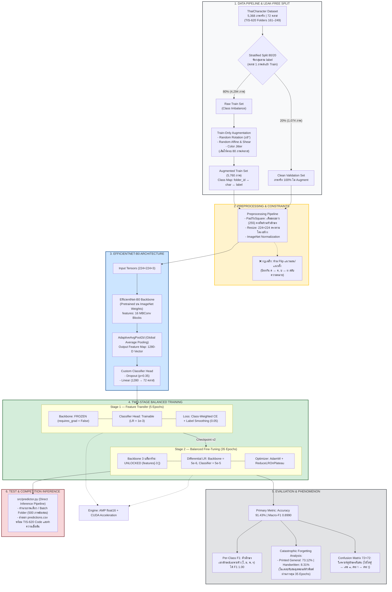

# ระบบจำแนกตัวอักษรไทย (Thai Character Recognition)
### 72-Class Thai Character Classification with EfficientNet-B0 & Two-Stage Transfer Learning

ระบบรู้จำและจำแนกตัวอักษรไทย 72 คลาส (พยัญชนะ สระ วรรณยุกต์ และตัวเลขไทย ตามรหัส TIS-620) พัฒนาด้วย PyTorch บนสถาปัตยกรรม **EfficientNet-B0** ผ่านกระบวนการฝึกสอนแบบ **2-Stage Transfer Learning** (Frozen Backbone $\to$ Fine-Tuning 35 Epochs) พร้อมรับมือปัญหาความไม่สมดุลของข้อมูลขั้นวิกฤต (Extreme Class Imbalance)

---

## ⚡ ประสิทธิภาพของโมเดลล่าสุด (Benchmark Results)

ผลการประเมินบนชุดข้อมูลตรวจสอบจริง (Validation Set — Clean $100\%$ ปราศจาก Data Leakage):

| เมตริกประเมินผล (Metric) | ค่าที่ได้ (Score) | คำอธิบาย |
|---|:---:|---|
| **Validation Accuracy** | **91.43%** | ความแม่นยำรวมทุกคลาส |
| **Validation Macro-F1** | **0.8990** | เมตริกหลักตัดสิน (ให้ความสำคัญกับคลาสส่วนน้อยเท่าเทียมกัน) |
| **Stage 2 Fine-Tuning** | **35 Epochs** | ปลดล็อก Feature Backbone 3 บล็อกท้ายสุด |
| **Primary Checkpoint** | `best_thai_character_finetuned.pth` | Checkpoint ที่ดีที่สุดพร้อมใช้ในการสอบและการทำนายจริง |
| **Base Checkpoint** | `best_thai_character_model_v2.pth` | Checkpoint ฐานสำหรับทำ Fine-tuning ต่อยอด |

---

## 🏗️ สถาปัตยกรรมระบบ (Model Architecture & Strategy)



### จุดเด่นเชิงวิศวกรรม (Key Highlights):
1. **PadToSquare (ขอบขาว 255)**: รักษาสัดส่วนรูปทรงและหัวของตัวอักษรไทย ป้องกันการบิดเบี้ยวจากการยืดหดภาพ
2. **Domain-Specific Constraints**: ปฏิบัติตามกฎเหล็ก **ห้าม Flip แนวนอน/แนวตั้ง** เพื่อป้องกันไม่ให้อักษรเปลี่ยนความหมาย (เช่น ด ↔ ค, บ ↔ ผ)
3. **Train-Only Augmentation & Leak-Free Splitting**: ทำการแบ่งข้อมูล 80:20 โดยจัดกลุ่มตาม `[label, source]` เพื่อรักษาสัดส่วนลายมือและตัวพิมพ์ และสร้างภาพสังเคราะห์เติมเฉพาะฝั่ง Train Set ให้มีขั้นต่ำ 80 ภาพ/คลาส โดย Validation Set คงสภาพเป็นภาพจริง $100\%$
4. **Class-Weighted CrossEntropy**: ชดเชยน้ำหนัก Loss ด้วย Inverse Square Root ($w = \text{clip}(\sqrt{\max(N)/N_c}, 1.0, 8.0)$) พร้อม Label Smoothing $0.05$

---

## 📁 โครงสร้างโปรเจกต์ (Clean & Production-Ready Layout)

```text
Solution 2 (Eungul + Ninenine)/
├── best_thai_character_finetuned.pth  # Checkpoint หลักที่ดีที่สุด (16.7 MB)
├── best_thai_character_model_v2.pth   # Checkpoint ฐาน (16.7 MB)
├── inference.py                       # [Main Entry Point] สคริปต์ทำนายผลภาพ (เดี่ยว / โฟลเดอร์)
├── train.py                           # [Main Entry Point] สคริปต์เทรนและ Fine-tune โมเดล
├── requirements.txt                   # รายการไลบรารีที่จำเป็น
├── README.md                          # เอกสารสรุปโปรเจกต์และคู่มือการใช้งาน
├── .vscode/                           # การตั้งค่า VS Code Workspace
└── src/                               # ซอร์สโค้ดและโมดูลระบบ
    ├── __init__.py                    # กำหนด Package
    ├── config.py                      # ไฮเปอร์พารามิเตอร์, พาธ, และพจนานุกรมถอดรหัส TIS-620
    ├── dataset.py                     # สแกนข้อมูล, Stratified Split, และ Offline Train Augmentation
    ├── predictor.py                   # คลาส ThaiCharacterPredictor และ Batch Processor
    ├── losses.py                      # คำนวณ Class Weights และ Loss Function
    ├── metrics.py                     # คำนวณ Accuracy, Macro-F1, Top-k, Confusion Matrix
    ├── models.py                      # นิยามโมเดล EfficientNet-B0 และฟังก์ชันโหลด Checkpoint
    ├── trainer.py                     # ลูปการฝึกสอน 2-Stage, AMP, และการบันทึกประวัติ
    └── transforms.py                  # Pipeline การแปลงภาพ (PadToSquare, Normalize)
```

---

## 🚀 คู่มือการใช้งานผ่าน Terminal (CLI Usage)

ทุกคำสั่งสามารถรันได้โดยตรงจากโฟลเดอร์โปรเจกต์ `Solution 2 (Eungul + Ninenine)`:

### 1. การทำนายผล (Inference) ในวันสอบและตรวจงานจริง (`inference.py`)

ระบบรองรับทั้งการทำนายภาพเดี่ยวและการทำนายทั้งโฟลเดอร์ พร้อมเลือกไฟล์ Checkpoint อัตโนมัติ (`best_thai_character_finetuned.pth` $\to$ `best_thai_character_model_v2.pth`):

#### 1.1 ทำนายภาพเดี่ยว (Single Image Prediction):
```bash
python inference.py --image "path/to/image.png" --top-k 3
```

**ตัวอย่างผลลัพธ์ใน Terminal**:
```text
[*] กำลังโหลด Checkpoint จาก: best_thai_character_finetuned.pth
[*] โหลดโมเดลสำเร็จ! จำนวนคลาส: 72 | Validation Macro-F1: 0.8990

============================================================
 ผลการทำนาย: sample_ko_kai.png
============================================================
 อันดับ   ตัวอักษรไทย     รหัส TIS-620       ค่า Confidence (%)
------------------------------------------------------------
 #1     ก              161 (0xA1)         99.45%         
 #2     ถ              182 (0xB6)         0.32%          
 #3     ภ              192 (0xC0)         0.11%          
============================================================
```

#### 1.2 ทำนายภาพทั้งโฟลเดอร์ (Batch Folder Prediction):
รองรับการสแกนหาไฟล์ภาพในโฟลเดอร์และโฟลเดอร์ย่อยแบบ Recursive พร้อมส่งออกผลการทำนายเป็นตาราง CSV:
```bash
python inference.py --folder "path/to/images_dir" --output-csv "predictions.csv" --top-k 3
```

#### 1.3 พารามิเตอร์ทั้งหมดของ `inference.py`:
| Parameter | Default | คำอธิบาย |
|---|:---:|---|
| `--image` | `None` | พาธของไฟล์รูปภาพเดี่ยวที่ต้องการทำนาย (เช่น `test.png`) |
| `--folder` | `None` | พาธของโฟลเดอร์รูปภาพที่ต้องการทำนายแบบ Batch |
| `--output-csv` | `predictions.csv` | พาธไฟล์สำหรับบันทึกผลการทำนายแบบ Batch (.csv) |
| `--top-k` | `3` | จำนวนอันดับผลลัพธ์ที่ต้องการแสดง |
| `--checkpoint` | `None` | กำหนดพาธไฟล์โมเดล Checkpoint โดยตรง (หากไม่ระบุจะค้นหาไฟล์ที่ดีที่สุดอัตโนมัติ) |

> [!NOTE]
> ต้องระบุอย่างน้อย 1 ตัวเลือกระหว่าง `--image` หรือ `--folder`

---

### 2. การเทรนและ Fine-tuning โมเดล (`train.py`)

#### 2.1 Fine-tuning ต่อยอดจาก Checkpoint ฐาน (35 Epochs):
```bash
python train.py --finetune-only --base-checkpoint "best_thai_character_model_v2.pth" --data-dir "./data"
```

#### 2.2 Full 2-Stage Training ตั้งแต่เริ่มต้น:
```bash
python train.py --data-dir "./data" --batch-size 256 --stage1-epochs 5 --stage2-epochs 35
```

---

### 3. การจัดวางโฟลเดอร์ Dataset สำหรับการฝึกสอน (Data Placement)
หากต้องการรันคำสั่งฝึกสอนโมเดลใหม่ (`train.py`) ให้นำโฟลเดอร์ภาพดิบ 72 คลาส (โฟลเดอร์รหัส 161 ถึง 249) มาวางไว้ที่โฟลเดอร์ `data/` หรือระบุผ่าน `--data-dir "path/to/dataset"`

