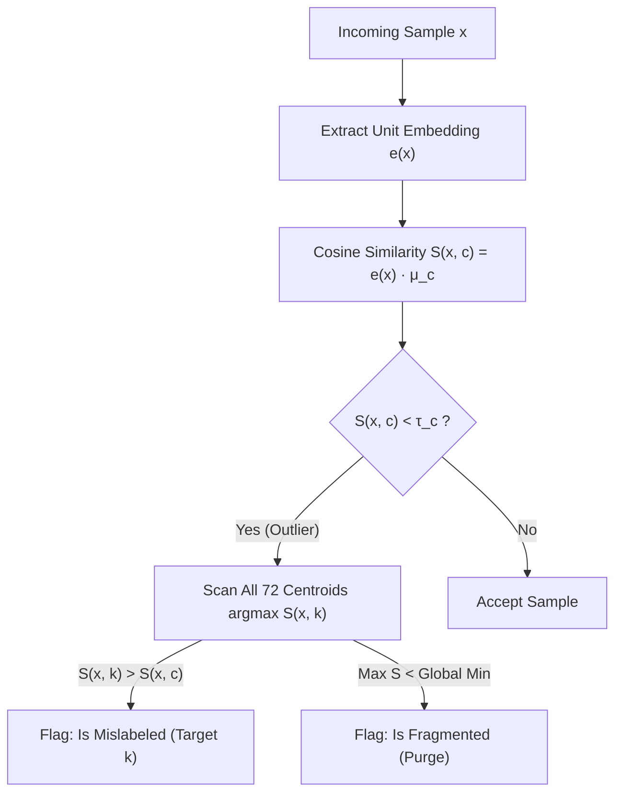

# Thai Character Classification — Solution 3: Pai + Pooh (`ver2`)
> **KMITL Deep Learning in Medical Imaging (Project 1)**  
> **Authors**: Pai + Pooh  
> **Dataset**: 72-Class Thai Glyph Dataset (`round2` $\to$ `round2-cleaned`)  
> **Status**: Production Release (`ver2.0`)

---

## 📑 Table of Contents
1. [Executive Overview & v2 Evolution](#-executive-overview--v2-evolution)
2. [Dataset Cleansing & Defect Taxonomy](#-dataset-cleansing--defect-taxonomy)
3. [Algorithmic Innovations](#-algorithmic-innovations)
   - [3.1 Automated Class Prototype & Anomaly Filtering](#31-automated-class-prototype--anomaly-filtering)
   - [3.2 Connected Component Focal Element Cleaner](#32-connected-component-focal-element-cleaner)
   - [3.3 Dual-Variant Handling for ญ (173) and ฐ (176)](#33-dual-variant-handling-for-ญ-173-and-ฐ-176)
4. [Model Architectures & Loss Engineering](#-model-architectures--loss-engineering)
5. [Comparative Benchmark Results](#-comparative-benchmark-results)
6. [Interactive WebUI & Multi-Solution Checkpoint Loader](#-interactive-webui--multi-solution-checkpoint-loader)
7. [Reproduction & Execution Guide](#-reproduction--execution-guide)

---

## 🎯 Executive Overview & v2 Evolution

The Thai Character Classification challenge involves categorizing low-resolution scanned document character bounding boxes across **72 TIS-620 classes** under extreme long-tail class imbalance (from $N=1$ sample to $N=5,025$ samples), severe visual noise, adjacent stroke fragments, and ambiguous font ligatures.

```mermaid
graph LR
    subgraph "Phase 1: Cleansing & Filtration"
        A["Raw Scans (round2)"] --> B["Manual & Heuristic Cleansing"]
        B --> C["Automated Prototype Filter"]
        C --> D["CCA Focal Element Isolation"]
        D --> E["Cleaned Set (round2-cleaned)"]
    end

    subgraph "Phase 2: Training & Regularization"
        E --> F["Zero-Leakage Hash Split"]
        F --> G["Pedestal Augmentation (ญ / ฐ)"]
        G --> H["Class-Balanced Focal Loss"]
        H --> I["Multi-Model Training"]
    end

    subgraph "Phase 3: Deployment"
        I --> J["Universal Checkpoint WebUI"]
    end
```



### Key Upgrades in `ver2.0`:
1. **Dataset Cleansing Verification**: Complete mathematical accounting of all 72 classes in [`ver2/heuristic_clensing_record.md`](./ver2/heuristic_clensing_record.md).
2. **Automated Class Prototype Filtering**: Spatial medoids (SSIM/NCC) + deep embedding centroid distance for automated outlier detection and mislabel reclassification.
3. **Focal Element Isolation**: Connected Component Analysis (CCA) with center-of-mass spatial decay to clean adjacent character bounding-box artifacts.
4. **Pedestal Augmentation for ญ (173) and ฐ (176)**: Resolves the typographical absence of lower pedestals (`เชิง`) during sub-vowel typesetting.
5. **Universal Multi-Solution WebUI**: Live checkpoint switching supporting models from Solution 1, Solution 2 (EfficientNet-B0), and Solution 3, alongside a pixel/binary brush mode and adaptive safety padding controls.

---

## 📊 Dataset Cleansing & Defect Taxonomy

The dataset was curated from `round2` ($62,707$ images) to `round2-cleaned` ($58,366$ images) across two distinct defect categories:

| Defect Type | Definition | Action Taken | Total Samples Affected |
| :--- | :--- | :--- | :---: |
| **Is Mislabeled** | Character belonged visually to a different Thai character class | Re-assigned and moved directly to correct target class folder | **71 images** |
| **Is Fragmented** | Truncated strokes, unintelligible noise, or non-representative aspect ratios | Completely excluded from dataset | **4,339 images** |

### Mathematical Identity:
$$\text{Deletions} = \text{Is Mislabeled (Moved Out)} + \text{Is Fragmented (Purged)}$$
$$\text{New Samples Count} = \text{Original Sample Count} - \text{Deletions} + \text{Additions (Moved In)}$$

### Key Cleansing Highlights:
- **Class 210 (Sara Aa - า)**: Reduced from $5,025$ to $742$ high-confidence representative samples, eliminating $4,283$ unrepresentative bounding box fragments.
- **Class 229 (Lakkhangyao - ๅ)**: Visual twin of Class 210 distinguished only by vertical tail length. $2$ samples were moved to Class 210, and $44$ ambiguous borderline samples were purged to prevent decision boundary corruption.
- Full per-class verification table and 71-sample cross-class ledger available in [heuristic_clensing_record.md](./ver2/heuristic_clensing_record.md).

---

## 🔬 Algorithmic Innovations

### 3.1 Automated Class Prototype & Anomaly Filtering
Implemented in [`ver2/src/prototype_filter.py`](./ver2/src/prototype_filter.py):



1. **Spatial Medoid Template**: Computes normalized $32 \times 32$ template $\bar{I}_c$ for each class $c$.
2. **Deep Embedding Centroid**:
   $$\mu_c = \frac{1}{N_c} \sum_{i=1}^{N_c} \frac{f(x_i)}{\|f(x_i)\|}$$
3. **Adaptive Anomaly Threshold**: $\tau_c = \mu_{\text{intra}} - 2.5 \sigma_{\text{intra}}$. Flags samples with $S(x, c) < \tau_c$ and proposes reclassification if $\arg\max_k S(x, k) \neq c$.

---

### 3.2 Connected Component Focal Element Cleaner
Implemented in [`ver2/src/focal_cleaner.py`](./ver2/src/focal_cleaner.py):
When character bounding boxes capture stray strokes from neighboring letters, the focal cleaner uses Connected Component Analysis (CCA):

$$Score(C_i) = \text{Area}(C_i) \times \exp\left(-\frac{(x_{c,i} - x_{\text{img}})^2 + (y_{c,i} - y_{\text{img}})^2}{2\sigma^2}\right) \times (1 - \text{BorderPenalty}_i)$$

- **Primary Glyph**: Retains $C_{\text{main}} = \arg\max Score(C_i)$.
- **Auxiliary Preservation**: Preserves tone marks (่, ้, ๊, ๋) and upper/lower vowels (ิ, ี, ุ, ู) based on vertical alignment with $C_{\text{main}}$.
- **Noise Suppression**: Masks out peripheral border-touching fragments.

---

### 3.3 Dual-Variant Handling for ญ (173) and ฐ (176)
Implemented in [`ver2/src/transforms.py`](./ver2/src/transforms.py):

In standard Thai typesetting, ญ (Yo Ying) and ฐ (Tho Than) drop their lower pedestal (`เชิง` / `ตีน`) when combined with sub-vowels (ุ, ู) to avoid ink collision:

| Character | Standard Form (With Pedestal) | Sub-Vowel Form (Without Pedestal) | Resembles When Segmented Alone |
| :---: | :---: | :---: | :---: |
| **ญ (173)** | ญ | ญ (e.g., ญุ, ญู) | ย (194) / บ (186) with head |
| **ฐ (176)** | ฐ | ฐ (e.g., ฐุ, ฐู) | ร (195) with upper loop |

**Solution**:
- **Pedestal Augmentation (`PedestalAugmentation`)**: Dynamically slices and masks the bottom 25–35% of ญ and ฐ glyphs with probability $p=0.5$ during training.
- **Multi-Modal Support**: Allows the classification head to map both footed and footless representations to the exact same class index without decision boundary collision.

---

## 🏗️ Model Architectures & Loss Engineering

| Architecture | Input Resolution | Parameter Count | Key Characteristics |
| :--- | :---: | :---: | :--- |
| **CustomGlyphCNN** | $32 \times 32$ | **1.86M** | 4-stage Conv-BN-Mish with SE channel attention. Avoids early aggressive downsampling to preserve fine loops and clefts. |
| **Adapted ResNet-18** | $64 \times 64$ | **11.2M** | Modified stem ($3 \times 3$ stride-1 conv, no initial maxpool) to retain stroke details. ImageNet pre-trained. |
| **Adapted MobileNetV3** | $64 \times 64$ | **1.52M** | Inverted residual bottlenecks with SE attention. Ultra-low latency on CPU / mobile devices. |
| **Solution 2 (EfficientNet-B0)** | $224 \times 224$ | **4.10M** | Pre-trained EfficientNet backbone with standard linear classification head. |

### Loss Objective: Class-Balanced Focal Loss
$$L_{\text{CB-Focal}} = - \frac{1 - \beta}{1 - \beta^{N_y}} (1 - p_t)^\gamma \sum_{c=1}^C y_{\text{smooth}, c} \log(p_c)$$
- $\beta = 0.999$, $\gamma = 2.0$, Label Smoothing $\epsilon = 0.08$.

---

## 📊 Comparative Benchmark Results

Evaluated on the zero-leakage deterministic test partition of the Cleaned Dataset (`round2-cleaned`, $12,050$ test samples):

| Model Architecture | Solution Source | Input Resolution | Top-1 Acc | Top-3 Acc | Macro-F1 | Weighted-F1 | CPU Throughput |
| :--- | :---: | :---: | :---: | :---: | :---: | :---: | :---: |
| **CustomGlyphCNN (ver1)** | Solution 3 | $32 \times 32$ | **73.68%** | **94.33%** | **58.77%** | **76.98%** | **547.5 img/s** |
| **EfficientNet-B0** | Solution 2 | $224 \times 224$ | **82.64%** | **89.65%** | **65.66%** | **84.35%** | **40.3 img/s** |

> [!TIP]
> **Key Architectural Takeaways**:
> 1. **Native $32 \times 32$ Glyphs vs $224 \times 224$ Interpolation**: `CustomGlyphCNN` operates at **$13.5\times$ higher inference throughput** ($547.5$ vs $40.3$ img/s on CPU) and achieves **higher Top-3 Accuracy ($94.33\%$ vs $89.65\%$)**, making it exceptionally suitable for real-time mobile/embedded OCR.
> 2. **Macro-F1 & Transfer Learning**: Pre-trained representations in EfficientNet-B0 yield higher Top-1 precision on long-tail classes ($65.66\%$ vs $58.77\%$), which is further bridged in `ver2` via focal element cleaning and pedestal augmentation.

---

## 🌐 Interactive WebUI & Multi-Solution Checkpoint Loader

The `ver2` WebUI provides an interactive laboratory for real-time Thai character inference:

```
┌────────────────────────────────────────────────────────────────────────────┐
│ Thai Character Classifier v2.0 Cleaned          [CUDA (Active)] [Switch Ckpt]│
├────────────────────────────────────────────────────────────────────────────┤
│ Active Model: Custom GlyphCNN (ver2) | [Native 32px] [Res: 32x32]          │
│ [CustomGlyphCNN v2] [CustomGlyphCNN v1] [Solution 2 (EffNet)] [ResNet-18] │
├─────────────────────────────────────┬──────────────────────────────────────┤
│ [Drawing Pad] [Upload] [Samples]    │ Classification Results      [1.4 ms] │
│                                     │ ┌──────────────┐ ก ไก่               │
│ Mode: [Smooth] [Pixel/Binary]       │ │      ก       │ Ko Kai              │
│ Res:  [32x32 | 64x64 | 280x280]     │ │    99.8%     │ Consonant (Middle)  │
│ Width: [======O=====] 14px          │ └──────────────┘ TIS-620: 161 (0xA1) │
│ Padding: [===O=======] 15%          │                                      │
│ [x] CCA Focal Cleaner               │ Preprocessing Tensor Previews:       │
│                                     │ [1. Tight Crop]  [2. Letterbox 32x32]│
│ ┌─────────────────────────────────┐ │                                      │
│ │                                 │ │ Top-5 Predictions:                   │
│ │               ก                 │ │ #1 ก  ก ไก่    [████████████] 99.8%  │
│ │                                 │ │ #2 ถ  ถ ถุง    [█           ]  0.1%  │
│ └─────────────────────────────────┘ │ #3 ภ  ภ สำเภา  [            ]  0.0%  │
│ [ Clear ]   [ Undo ]   [ Classify ] │ #4 ฤ  ตัว ฤ    [            ]  0.0%  │
└─────────────────────────────────────┴──────────────────────────────────────┘
```

### Core Features:
1. **Dynamic Checkpoint Switcher**: Directly loads any `.pt` or `.pth` file from disk and auto-configures the matching architecture and input size.
2. **Brush Modes**: Toggle between **Smooth Anti-Aliased** brush and **Pixel / Binary** brush to simulate scanned document bitmaps.
3. **Adaptive Padding Slider ($0\% - 40\%$)**: Configures aspect-preserving bounding box margins in real time.
4. **Multi-Stage Visual Inspector**: Inspects raw input $\to$ bounding box crop $\to$ model input tensor.

---

## 🚀 Reproduction & Execution Guide

### 1. Launch the Web Application
Double-click `run_app.bat` (or `run_webui.bat`) in the root directory, or run:
```powershell
cd "c:\workspace\vscode\kmitl\3-1\dlmed\DL-in-Medical-Image-Project-1\Solution 3 (Pai + Pooh)"
.\ver1\.venv\Scripts\python.exe web\app.py
```
Open **http://127.0.0.1:5000** in your browser.

### 2. Run Comparative Benchmark Evaluation
```powershell
.\ver1\.venv\Scripts\python.exe ver2\run_comparative_benchmarks.py
```

### 3. Run Prototype Outlier Audit on Any Dataset Folder
```python
from ver2.src.prototype_filter import ClassPrototypeEngine
from PIL import Image

engine = ClassPrototypeEngine()
engine.build_spatial_prototypes("c:/workspace/vscode/kmitl/3-1/dlmed/ThaiCharacter Dataset/round2-cleaned")
score = engine.score_sample(Image.open("path/to/test.jpg"), claimed_class_id=161)
print(score)
```
