# Thai Character Classification — Solution 3: Pai + Pooh (`ver2`)
> **KMITL Deep Learning in Medical Imaging (Project 1)**  
> **Authors**: Pai + Pooh  
> **Dataset**: 72-Class Thai Glyph Dataset (`round2` $\to$ `round2-cleaned`, `dataset-ajbank`, `dataset-bam`, etc.)  
> **Status**: Production Release (`ver2.0`)

---

## 📑 Table of Contents
1. [Executive Overview & v2 Evolution](#-executive-overview--v2-evolution)
2. [Dataset Cleansing & Defect Taxonomy](#-dataset-cleansing--defect-taxonomy)
3. [Algorithmic Innovations & Data Pipeline](#-algorithmic-innovations--data-pipeline)
   - [3.1 Multi-Source Dataset Union & Auto-Reject Engine](#31-multi-source-dataset-union--auto-reject-engine)
   - [3.2 Zero-Leakage Deterministic Hash Partitioning](#32-zero-leakage-deterministic-hash-partitioning)
   - [3.3 Connected Component Focal Element Cleaner](#33-connected-component-focal-element-cleaner)
   - [3.4 Dual-Variant Handling for ญ (173) and ฐ (176)](#34-dual-variant-handling-for-ญ-173-and-ฐ-176)
   - [3.5 Aspect-Preserving Morphological Augmentation](#35-aspect-preserving-morphological-augmentation)
4. [Fine-Tuning & Knowledge Loss Mitigation](#-fine-tuning--knowledge-loss-mitigation)
5. [Model Architectures & Loss Engineering](#-model-architectures--loss-engineering)
6. [Comparative Benchmark Results](#-comparative-benchmark-results)
7. [Interactive WebUI & Multi-Solution Checkpoint Loader](#-interactive-webui--multi-solution-checkpoint-loader)
8. [Reproduction & Execution Guide](#-reproduction--execution-guide)

---

## 🎯 Executive Overview & v2 Evolution

The Thai Character Classification challenge involves categorizing low-resolution scanned document character bounding boxes across **72 TIS-620 classes** under extreme long-tail class imbalance (from $N=1$ sample to $N=5,025$ samples), severe visual noise, adjacent stroke fragments, and ambiguous font ligatures.

```mermaid
graph LR
    subgraph "Phase 1: Cleansing & Multi-Source Ingestion"
        A["Raw Scans / Datasets"] --> B["Multi-Path Union & Auto-Reject"]
        B --> C["Automated Prototype Filter"]
        C --> D["CCA Focal Element Isolation"]
        D --> E["Cleaned Standardized Set"]
    end

    subgraph "Phase 2: Training & Regularization"
        E --> F["Zero-Leakage Hash Split"]
        F --> G["Pedestal & Morphological Aug"]
        G --> H["Class-Balanced Focal Loss"]
        H --> I["AMP Multi-Model Training"]
    end

    subgraph "Phase 3: Domain Adaptation & WebUI"
        I --> J["Fine-Tuning Engine"]
        J --> K["Universal Checkpoint WebUI"]
    end
```



### Key Upgrades in `ver2.0`:
1. **Centralized Master Configuration**: All paths, hardware options, augmentation flags, and training hyperparameters are centralized in **Cell 02** of the Jupyter notebook.
2. **Multi-Source Dataset Support**: Supply single paths or lists of paths with automated union discovery across 72 classes (handles missing/sparse classes per directory seamlessly).
3. **Configurable Sample Auto-Reject (`USE_AUTO_REJECT_SAMPLE`)**: Bypasses image validation for maximum speed on cleaned datasets, or filters out corrupted/empty crops on raw datasets.
4. **Fine-Tuning & Knowledge Retention**: Two-Stage Gradual Unfreezing and Discriminative Layer Learning Rates ($5\times$ head multiplier) to prevent catastrophic forgetting.
5. **Loss Numerical Stabilization**: Float32 upcasted loss calculation eliminating `NaN` losses under CUDA AMP FP16 mixed precision.
6. **Aspect-Preserving Morphological Transforms**: Scaling with aspect-ratio preservation so $\min(w, h) \ge 32\text{px}$ prevents fine loop destruction on tiny crops.
7. **Pedestal Augmentation for ญ (173) and ฐ (176)**: Resolves the typographical absence of lower pedestals (`เชิง`) during sub-vowel typesetting.
8. **Universal WebUI & Sarabun Font Integration**: Interactive drawing pad with instant checkpoint switching and Matplotlib Thai font support.

---

## 🔬 Algorithmic Innovations & Data Pipeline

### 3.1 Multi-Source Dataset Union & Auto-Reject Engine
Implemented in [`ver2/src/dataset.py`](./ver2/src/dataset.py):
- **Multi-Path Ingestion**: Accepts a single `Path` or a `List[Path]` in `CUSTOM_DATASET_DIR` and `CUSTOM_VAL_DIR`.
- **Sparse Class Union**: Automatically maps the global union of all discovered numeric class folders (`161/` to `251/`) to a unified index schema ($0 \dots 71$).
- **Auto-Reject Mode (`USE_AUTO_REJECT_SAMPLE`)**:
  - `False` (Default): Instantaneous file index scanning for pre-cleaned datasets.
  - `True`: Evaluates pixel stroke counts ($\ge 5$ foreground pixels) to discard unreadable, corrupted, or completely empty crops.

### 3.2 Zero-Leakage Deterministic Hash Partitioning
```
Raw Image: "doc042_page03_161_004_sg.png" ──► Group Key: "doc042_page03" ──► SHA-256 % 100 < 80 ──► Train (80%) / Test (20%)
```
- Groups images by physical document page and counterpart scans (`_sg` and `_tg`).
- SHA-256 hash partitioning ensures zero document-level data leakage between train and test splits.

### 3.3 Connected Component Focal Element Cleaner
Implemented in [`ver2/src/focal_cleaner.py`](./ver2/src/focal_cleaner.py):
$$Score(C_i) = \text{Area}(C_i) \times \exp\left(-\frac{(x_{c,i} - x_{\text{img}})^2 + (y_{c,i} - y_{\text{img}})^2}{2\sigma^2}\right) \times (1 - \text{BorderPenalty}_i)$$
- **Primary Glyph**: Retains $C_{\text{main}} = \arg\max Score(C_i)$.
- **Auxiliary Preservation**: Retains tone marks (่, ้, ๊, ๋) and upper/lower vowels (ิ, ี, ุ, ู) aligned with $C_{\text{main}}$.
- **Noise Suppression**: Suppresses border-touching fragments from adjacent characters.

### 3.4 Dual-Variant Handling for ญ (173) and ฐ (176)
Implemented in [`ver2/src/transforms.py`](./ver2/src/transforms.py):
In standard Thai typesetting, ญ (Yo Ying) and ฐ (Tho Than) drop their lower pedestal (`เชิง` / `ตีน`) when combined with sub-vowels (ุ, ู):

| Character | Standard Form (With Pedestal) | Sub-Vowel Form (Without Pedestal) | Resembles When Segmented Alone |
| :---: | :---: | :---: | :---: |
| **ญ (173)** | ญ | ญ (e.g., ญุ, ญู) | ย (194) / บ (186) with head |
| **ฐ (176)** | ฐ | ฐ (e.g., ฐุ, ฐู) | ร (195) with upper loop |

`PedestalAugmentation` dynamically masks the bottom 25–35% of ญ and ฐ glyphs with probability $p=0.5$, teaching the network to recognize both variants under a single class ID.

### 3.5 Aspect-Preserving Morphological Augmentation
To simulate ink bleed and scanner degradation without destroying loops on small bounding-box crops (e.g., $17 \times 12\text{px}$), `MorphologicalTransform` scales crops to $\min(w, h) \ge 32\text{px}$ while preserving aspect ratio before applying dilation/erosion.

---

## 🔄 Fine-Tuning & Knowledge Loss Mitigation

When transferring weights from large typography models (58k images) to smaller domain datasets (e.g., handwriting), the pipeline mitigates **Catastrophic Forgetting**:

```
Typography Base Weights (58k images)
                 │
                 ├── 1. Two-Stage Gradual Unfreezing (Freeze backbone for initial warmup epochs)
                 ├── 2. Discriminative Learning Rates (Backbone: 1e-4, Head: 5e-4)
                 ├── 3. Regularization & Gradient Norm Clipping (Clip norm: 5.0, Weight Decay: 1e-2)
                 └── 4. Exemplar Replay (Optional co-training with 10-20% typography anchors)
```

In `ver2/notebooks/thai_character_training_and_evaluation.ipynb`, configure:
```python
FINETUNE_MODE = True                  # Load pre-trained checkpoint and fine-tune
PRETRAINED_CHECKPOINT_PATH = None      # Auto-loads best_model.pt for the chosen architecture
FREEZE_BACKBONE_EPOCHS = 2             # Freeze backbone during early epochs to protect stroke features
HEAD_LR_MULTIPLIER = 5.0               # Head LR = 5x Backbone LR
LEARNING_RATE = 1e-4                   # Recommended fine-tuning base LR
```

---

## 🏗️ Model Architectures & Loss Engineering

| Architecture | Input Resolution | Parameter Count | Key Characteristics |
| :--- | :---: | :---: | :--- |
| **CustomGlyphCNN** | $32 \times 32$ | **678K** | 4-stage Conv-BN-Mish with SE channel attention. Preserves fine loops without early downsampling. |
| **Adapted ResNet-18** | $64 \times 64$ | **11.2M** | Modified stem ($3 \times 3$ stride-1 conv, no initial maxpool) to retain stroke details. ImageNet pre-trained. |
| **Adapted MobileNetV3** | $64 \times 64$ | **1.52M** | Inverted residual bottlenecks with SE attention. Ultra-low latency on CPU / mobile devices. |
| **Adapted EfficientNet-B0** | $224 \times 224$ | **4.10M** | Pre-trained EfficientNet backbone with standard linear classification head. |

### Loss Objective: Class-Balanced Focal Loss
$$L_{\text{CB-Focal}} = - \frac{1 - \beta}{1 - \beta^{N_y}} (1 - p_t)^\gamma \sum_{c=1}^C y_{\text{smooth}, c} \log(p_c)$$
- $\beta = 0.999$, $\gamma = 2.0$, Label Smoothing $\epsilon = 0.08$.
- Computed in `float32` for complete numerical stability under FP16 AMP.

---

## 📊 Comparative Benchmark Results

Evaluated on the zero-leakage deterministic test partition of the Cleaned Dataset (`round2-cleaned`, $12,210$ test samples):

| Model Architecture | Input Resolution | Top-1 Acc | Top-3 Acc | Macro-F1 | Weighted-F1 | CPU Speed |
| :--- | :---: | :---: | :---: | :---: | :---: | :---: |
| **CustomGlyphCNN (ver2)** | $32 \times 32$ | **98.85%** | **99.92%** | **97.20%** | **98.83%** | **~550 img/s** |
| **Adapted ResNet-18** | $64 \times 64$ | **98.92%** | **99.94%** | **97.45%** | **98.90%** | **~180 img/s** |
| **Adapted MobileNetV3** | $64 \times 64$ | **98.41%** | **99.88%** | **96.50%** | **98.39%** | **~320 img/s** |
| **EfficientNet-B0** | $224 \times 224$ | **98.60%** | **99.85%** | **96.80%** | **98.55%** | **~40 img/s** |

---

## 🌐 Interactive WebUI & Multi-Solution Checkpoint Loader

```
┌────────────────────────────────────────────────────────────────────────────┐
│ Thai Character Classifier v2.0 Cleaned          [CUDA (Active)] [Switch Ckpt]│
├────────────────────────────────────────────────────────────────────────────┤
│ Active Model: Custom GlyphCNN (ver2) | [Native 32px] [Res: 32x32]          │
│ [CustomGlyphCNN v2] [CustomGlyphCNN v1] [Solution 2 (EffNet)] [ResNet-18] │
├─────────────────────────────────────┬──────────────────────────────────────┤
│ [Drawing Pad] [Upload] [Samples]    │ Classification Results      [1.4 ms] │
│                                     │ ┌──────────────┐ ก ไก่               │
│ Mode: [Smooth] [Pixel/Binary]       │ │      ก       │ Ko Kai              │
│ Res:  [32x32 | 64x64 | 280x280]     │ │    99.8%     │ Consonant (Middle)  │
│ Width: [======O=====] 14px          │ └──────────────┘ TIS-620: 161 (0xA1) │
│ Padding: [===O=======] 15%          │                                      │
│ [x] CCA Focal Cleaner               │ Preprocessing Tensor Previews:       │
│                                     │ [1. Tight Crop]  [2. Letterbox 32x32]│
│ ┌─────────────────────────────────┐ │                                      │
│ │                                 │ │ Top-5 Predictions:                   │
│ │               ก                 │ │ #1 ก  ก ไก่    [████████████] 99.8%  │
│ │                                 │ │ #2 ถ  ถ ถุง    [█           ]  0.1%  │
│ └─────────────────────────────────┘ │ #3 ภ  ภ สำเภา  [            ]  0.0%  │
│ [ Clear ]   [ Undo ]   [ Classify ] │ #4 ฤ  ตัว ฤ    [            ]  0.0%  │
└─────────────────────────────────────┴──────────────────────────────────────┘
```

---

## 🚀 Reproduction & Execution Guide

### 1. Launch the Web Application
```powershell
cd "c:\workspace\vscode\kmitl\3-1\dlmed\DL-in-Medical-Image-Project-1\Solution 3 (Pai + Pooh)"
.\ver1\.venv\Scripts\python.exe web\app.py
```
Open **http://127.0.0.1:5000** in your browser.

### 2. Run Training & Evaluation in Jupyter Notebook
Open [`ver2/notebooks/thai_character_training_and_evaluation.ipynb`](./ver2/notebooks/thai_character_training_and_evaluation.ipynb).
All path configurations and hyperparameters are controlled from **Cell 02**:
```python
# Custom dataset path (single path or list of paths):
CUSTOM_DATASET_DIR = Path(r"C:\path\to\your\dataset")

# Fine-tuning toggle:
FINETUNE_MODE = False  # Set True to fine-tune from best_model.pt
```

### 3. Run Pipeline Unit Tests
```powershell
.\ver1\.venv\Scripts\python.exe ver2\tests\test_pipeline.py
```
